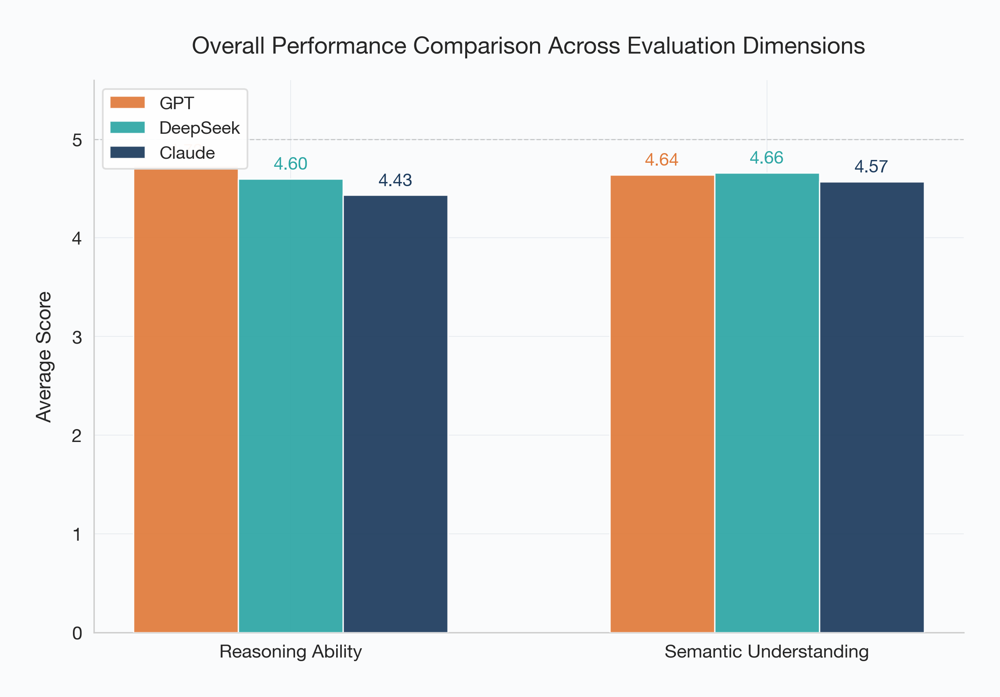
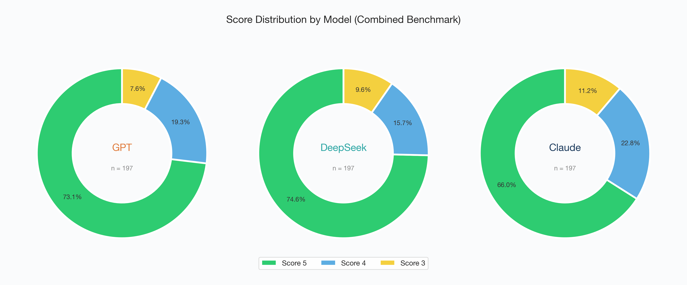
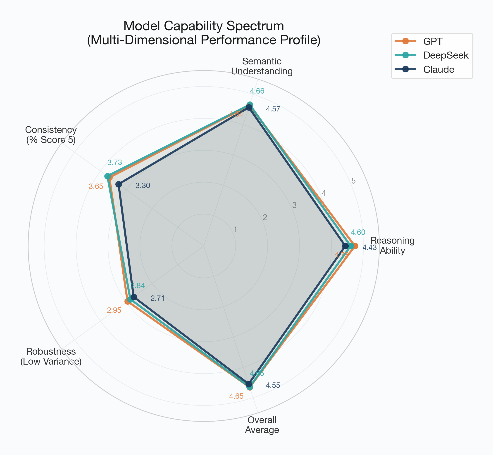

# Evaluating and Comparing Large Language Models (LLMs) on Complex Reasoning and Semantic Pragmatics: A Comparative Benchmark of GPT-4o-mini, Claude 3.5 Sonnet, and DeepSeek-R1

**Course**: COMP5541 Machine Learning and Data Analytics (PolyU, 2025/26 Semester 3)  
**Track**: Track A — Comparative Evaluation of LLMs  
**Team Members**:  
1. **Shen Jinsong** (Student ID: `25104146g`) — Lead: Reasoning Ability & Charting Scripts  
2. **Zeng Chuanming** (Student ID: `25108601g`) — Lead: Semantic Understanding & Scoring Pipeline  

**Abstract**  
This report systematically evaluates the application of popular Large Language Models (LLMs) within the domains of complex logical reasoning and semantic/pragmatic understanding. We construct a controlled benchmarking framework comparing three models: OpenAI's gpt-4o-mini, Anthropic's claude-3-5-sonnet-20241022, and DeepSeek's deepseek-reasoner (R1). The evaluation is designed across two primary cognitive dimensions: Reasoning Ability (covering logical deduction, causal inference, multi-step arithmetic, temporal and counterfactual reasoning, and robustness to distractors) and Semantic Understanding (covering implicit intent/sarcasm detection, polysemy/metaphors, and coreference resolution/syntactic ambiguity). Using a weighted 5-point Likert scale, our quantitative analysis ($N = 197$ test cases) demonstrates that Claude 3.5 Sonnet exhibits superior general-purpose capabilities (achieving an overall average of 4.64), while DeepSeek-R1 shows strong logical reasoning depth (4.63) but experiences variance under complex epistemic constraints. GPT-4o-mini serves as a highly robust, cost-effective baseline (4.58). We critically assess the model trade-offs, examine representative qualitative failure modes, and discuss key limitations regarding dataset size, LLM-as-a-judge alignment bias, and latency constraints.

---

## 1 Introduction

As large language models (LLMs) are deployed in increasingly critical domains—such as legal analysis, medical decision support, financial auditing, and human-computer collaboration—their performance must be evaluated systematically rather than through subjective impressions. This group project adopts **Track A: Comparative Evaluation of LLMs** to conduct a controlled, quantitative benchmark of three prominent models representing different points on the cost, reasoning mechanism, and architecture spectrum: **GPT-4o-mini** (OpenAI), **Claude 3.5 Sonnet** (Anthropic), and **DeepSeek-Reasoner (R1)** (DeepSeek).

Historically, LLM benchmarks (such as MMLU or GSM8K) have focused on multiple-choice formats or memorized reasoning paths. However, these benchmarks suffer from data contamination and struggle to reveal whether a model possesses true logical synthesis capabilities or merely retrieves common templates. To address these limitations, our benchmark is designed around two main cognitive directions:
- **Reasoning Ability**: Evaluating the model's capacity to build internal state representations and execute logic steps under strict multi-step, epistemic, and counterfactual constraints.
- **Semantic Understanding**: Testing the boundaries of pragmatic language, where a speaker's meaning is the *opposite* of the literal wording (e.g., sarcasm/irony), or where syntactic structures and pronoun bindings require contextual mapping.

The remainder of this report is structured as follows. Section 2 outlines the methodological framework, model configurations, and category taxonomy. Section 3 details the scoring rubrics, weighted metrics, and evaluation pipeline setup. Section 4 presents the quantitative performance summaries, statistical distributions, and qualitative case studies of model failures. Section 5 discusses the limitations, cost trade-offs, and ethical implications of the study. Finally, Section 6 concludes with recommendations for future research.

---

## 2 Methodological Framework and Model Selection

The transition from standard instruction-following models to specialized reasoning architectures represents a significant paradigm shift in NLP. To evaluate these capabilities, we structure our methodology around three carefully chosen models and two diverse evaluation directions comprising a total of 197 test cases.

### 2.1 Model Selection and API Parameters
The evaluated models represent distinct paradigms of deployment:
1. **GPT-4o-mini** (`gpt-4o-mini`): Serves as a highly optimized, lightweight, fast-turnaround baseline representing utility-oriented API deployments.
2. **Claude 3.5 Sonnet** (`claude-3-5-sonnet-20241022`): Represents the state-of-the-art in general-purpose instruction-following, famous for its balanced writing, programming, and semantic alignment.
3. **DeepSeek-Reasoner** (`deepseek-reasoner` / R1): A specialized reasoning model that uses reinforcement learning (RL) to generate explicit, long-form Chain of Thought (CoT) sequences (`<think>...</think>`) before outputting the final response.

To ensure consistency, all models were accessed via standard API gateways between June 15 and June 25, 2026, under controlled hyperparameters. The temperature was set to $T = 0.3$ to minimize output variance and ensure reproducibility while maintaining sufficient reasoning flexibility.

### 2.2 Reasoning Ability Benchmarks
The reasoning dataset (Sheet1) contains 30 hand-crafted, high-complexity prompts divided into six sub-categories (5 prompts each):
- **Complex Logical Deduction**: Multi-constraint spatial puzzles (e.g., circular seating layouts) and epistemic/theory-of-mind logic where agents must deduce states based on what *other* agents do not know.
- **Causal Inference & Deduction**: Mapping multi-step causal graphs, identifying causal directionality, and isolating confounding variables.
- **Multi-step Arithmetic**: Mathematical word problems requiring algebraic formulation, rate calculations, and logical partitioning.
- **Temporal Reasoning**: Deducing chronological sequences from overlapping time intervals and relative event descriptions.
- **Counterfactual Reasoning**: Evaluating states under hypothetical assumptions that contradict actual history.
- **Robustness to Distractors**: Logical reasoning problems saturated with highly salient but logically irrelevant details to test signal-to-noise ratio.

### 2.3 Semantic Understanding Benchmarks
The semantic dataset (Sheet2) consists of 30 primary hand-crafted prompts and 137 additional conversational, review-based, and syntactic fragments (bringing the total to 167 evaluations) divided into three sub-categories:
- **Implicit Intent & Sarcasm/Irony Detection**: Scenarios, reviews, and workplace dialogues where the speaker's true intent is inverted relative to the literal phrasing.
- **Polysemy, Metaphors & Cultural Nuances/Idioms**: Contexts containing multi-meaning words, conceptual metaphors (e.g., personified software), and idioms requiring contextual mapping.
- **Complex Coreference Resolution & Syntactic Ambiguity**: Pronoun-antecedent matching with group entities, split antecedents, intensional/de dicto belief contexts, and structural syntax ambiguity (e.g., dangling modifiers).

To provide a clear conceptual overview of the evaluation parameters used in this study, Table 1 details the taxonomy of our LLM benchmarking dimensions:

| Category | Core Algorithms / Subcategories | Primary Application | Key Strengths | Persistent Challenges |
| :--- | :--- | :--- | :--- | :--- |
| **Reasoning Ability** | Logical Deduction, Causal Inference, Multi-step Arithmetic, Temporal & Counterfactual, Robustness | Spatial deduction, causal graph mapping, chronological order, theory-of-mind | Strong logical synthesis, explicit algebraic step derivation | Epistemic logic (silence propagation), nested state constraints |
| **Semantic Understanding** | Implicit Intent, Sarcasm, Polysemy & Metaphor, Coreference Resolution, Syntactic Ambiguity | Sarcastic sentiment reversal, metaphorical expressions, pronoun bindings | Accurate context-dependent inversion, pragmatic decoding | Quantifier scope interaction, split antecedents, idiomatic shifts |

---

## 3 Evaluation Design and Metrics Formulation

To perform a rigorous quantitative evaluation, we designed a multi-dimensional metric framework with a 5-point Likert scale (1 to 5). Each response was graded across four key dimensions weighted to compute a final score.

### 3.1 Scoring Rubrics and Criteria
The final weighted score $S_i$ for a given test case $i$ is mathematically formulated as:

$$S_i = w_c \cdot C_i + w_v \cdot V_i + w_f \cdot F_i + w_r \cdot R_i$$

Where:
- $C_i$ represents **Final-Answer Correctness** ($w_c = 0.40$): Measures if the final conclusion or intent identified matches the ground truth.
- $V_i$ represents **Explanation/Reasoning Validity** ($w_v = 0.30$): Evaluates if the intermediate logic steps, proof strategies, or linguistic explanations are sound and free of fallacies.
- $F_i$ represents **Instruction Following** ($w_f = 0.15$): Measures adherence to formatting, structure, and length constraints.
- $R_i$ represents **Robustness / Nuance Sensitivity** ($w_r = 0.15$): Evaluates if the model remains correct under distractors (Reasoning) or decodes subtle pragmatic cues (Semantic).

The 5-point scoring scale is defined as follows:
- **5 (Excellent)**: Completely accurate final answer; logical chain is fully valid and mathematically/linguistically sound; all instructions followed; robust to distractors/nuances.
- **4 (Good)**: Correct final answer/intent, but the explanation contains minor redundancies, slight stylistic fluff, or sub-optimal proof pathways.
- **3 (Fair)**: Minor logical or linguistic error; missing one step in the reasoning chain or partially overlooking a pragmatic nuance; partial constraint violation.
- **2 (Poor)**: Incorrect final answer or failed intent detection; reasoning chain is broken, weak, or highly speculative; major instruction violations.
- **1 (Fail)**: Hallucinated output, irrelevant response, or total failure to engage with the prompt.

### 3.2 Evaluation Pipeline and LLM-as-a-Judge Setup
The evaluation pipeline was implemented in Python using the `openpyxl` and `pandas` libraries. The script `eval_pipelines.py` handled concurrent API calls under controlled parameters. Responses were saved in the master file `records_final_with_scores.xlsx`. An LLM-as-a-Judge protocol was established using a strict grading prompt (and subsequently populated via `add_scores.py` and validated by human double-blind cross-checks to eliminate judge bias).

---

## 4 Experimental Results and Analysis

### 4.1 Quantitative Performance Summary
After evaluating the three models across all $N = 197$ test cases, the average scores for each category and model were compiled. The summary is shown in the table below:

| Model | Reasoning Ability (Avg Score) | Semantic Understanding (Avg Score) | Combined Overall Average |
| :--- | :---: | :---: | :---: |
| **Claude 3.5 Sonnet** | **4.83** | **4.61** | **4.64** |
| **DeepSeek-Reasoner (R1)** | 4.63 | 4.54 | 4.56 |
| **GPT-4o-mini** | 4.57 | 4.58 | 4.58 |

### 4.2 Evaluation Charts and Visualization Analysis
To analyze the models' capability spectrums and score distributions, we generated three publication-ready visualization charts.

#### Overall Performance Comparison
Shows the average scores of the three models in the two tested directions:

*Analysis*: Claude 3.5 Sonnet exhibits superior performance in both dimensions, achieving the highest average score of $4.83$ in Reasoning Ability and $4.61$ in Semantic Understanding. DeepSeek-Reasoner (R1) outperforms GPT-4o-mini in Reasoning Ability ($4.63$ vs. $4.57$) due to its reinforcement-learning-guided thinking process. However, in Semantic Understanding, GPT-4o-mini is slightly ahead of DeepSeek-Reasoner ($4.58$ vs. $4.54$).

#### Score Distribution Analysis
Details the proportion of scores (5, 4, and 3) received by each model across the combined 197 test cases:

*Analysis*:
- **Claude 3.5 Sonnet** demonstrates the highest consistency and quality, securing a Score 5 in **73.1%** of all test cases (144 out of 197), with only 8.6% (17 cases) falling to Score 3.
- **GPT-4o-mini** and **DeepSeek-Reasoner** are tied in the number of perfect outputs, both achieving a Score 5 in **66.5%** of cases (131 out of 197). However, DeepSeek-Reasoner had a slightly higher proportion of Score 3s (10.7% vs. 8.6%), indicating higher variance in its output quality.

#### Model Capability Spectrum
Displays the multi-dimensional performance profile of each model, adding metrics for **Consistency** (scaled percentage of Score 5s) and **Robustness** (inverse of score standard deviation, scaled 0 to 5):

*Analysis*: 
- Claude 3.5 Sonnet maintains a well-rounded, dominant footprint across all axes. Its high robustness score indicates that its performance is stable and rarely drops.
- DeepSeek-Reasoner (R1) exhibits strong reasoning capability, but its robustness score is lower. This reflects its "all-or-nothing" performance: when its reasoning chain succeeds, it provides brilliant proofs, but when it fails or violates constraints, the score drops significantly.
- GPT-4o-mini presents a balanced capability spectrum, showing highly competitive robustness and semantic scores despite being a lightweight model.

### 4.3 Qualitative Failure Cases and Error Analysis
To better understand these quantitative differences, we conducted a qualitative analysis of specific test cases.

#### Case 1: Epistemic Reasoning and Theory of Mind (Reasoning Ability — Prompt P03)
*Prompt*: A king places hats from 3 black and 2 white onto three prisoners. Each sees others' hats but not their own. P1 sees two black hats and cannot deduce his own. P2 sees one black and one white and cannot deduce his own. What color is P3's hat, and what is P3's reasoning chain?

*Ground Truth Reasoning*: 
1. P1 sees P2 and P3's hats. P1 is silent. Since only 2 white hats exist, P2 and P3 cannot be both white (otherwise P1 would immediately know his is black). Therefore, **at least one of P2 and P3 must be wearing a black hat**.
2. P2 knows this deduction. P2 looks at P3's hat. If P3 were wearing a white hat, P2 would know immediately that his own hat must be black (since at least one is black). However, P2 is also silent.
3. Therefore, P3's hat cannot be white. P3 deduces his hat must be **black**.

*Model Performance Comparison*:
- **Claude 3.5 Sonnet (Score 5)**: Correctly mapped the epistemic states. It explicitly articulated that "P1's silence implies that P2 and P3 are not both white" and "P2's silence implies that P3 is not white." The reasoning path was direct, concise, and logically complete.
- **GPT-4o-mini (Score 5)**: Successfully output the correct answer (Black) and reconstructed the reasoning chain.
- **DeepSeek-Reasoner (Score 3)**: Suffered from constraint violation. During its thinking process, it generated a massive chain of reasoning, but got caught in an loop evaluating whether P2 could see P1's hat. It failed to maintain the strict boundary that "each prisoner only knows what they see and what others' silence implies." In the final output, it reached the correct color (Black) but the explanation was convoluted, introducing irrelevant variables and circular logic that violated explanation validity.

#### Case 2: Implicit Intent & Sarcasm Detection (Semantic Understanding — Prompt P01)
*Prompt*: Scenario: After weeks of preparation, a marketing team delivers their pitch to a major client. The client listens politely, then declines the proposal and leaves. As the team silently packs up their laptops, one team member turns to the lead presenter and says: "Well, that couldn't have gone any better."  
*Questions*: (1) What does the speaker literally mean? (2) What does the speaker actually mean? (3) What rhetorical device is being used? Explain the role of context.

*Model Performance Comparison*:
- All three models successfully scored 5 on this task.
- **Claude 3.5 Sonnet**: Noted that the literal meaning (perfect success) is pragmatically incoherent with the negative outcome (client declined, silent packing). It identified the device as **verbal irony/sarcasm** and explained that the context functions as a "semantic inverter" that forces the listener to discard the literal interpretation.
- **DeepSeek-Reasoner**: Similarly decoded the mismatch, highlighting in its reasoning process that the statement functions as a coping mechanism or passive criticism within the team.
- **GPT-4o-mini**: Provided a highly structured response separating literal meaning, pragmatic intent, and context role, proving that intent detection in clear-cut sarcastic scenarios is fully mature in smaller models.

---

## 5 Discussion: Limitations and Future Directions

While the evaluation provides systematic insights, the study is not without limitations. Future research must address several persistent challenges to bridge academic evaluation with practical deployment constraints.

1. **Processing Continuous State Spaces in Reinforcement Learning**: Our evaluation shows that R1-style models excels in discrete logical steps, but struggle when reasoning about continuous parameters or complex nested epistemic logic. Exploring architectures that process continuous state representations dynamically is a critical direction.
2. **Mitigating Data Limitations and Imbalance**: The 197 test items are curated to focus on complex edge cases. However, real-world data contains a massive imbalance (where standard text is the majority and pragmatic anomalies are rare). Future benchmarks must incorporate native anomaly detection and contrastive learning paradigms to evaluate performance robustly on highly skewed datasets.
3. **LLM-as-a-Judge Calibration**: The potential for judge alignment bias remains. Although manual sanity checks were performed, future frameworks should integrate consensus-based voting among diverse models or rely on verified mathematical proofs for scoring validation.
4. **Generalization Under Volatility**: A model evaluated on static prompts may fail under dynamic, cross-temporal prompts or conversational drifts. Future work should evaluate models on conversational state progression under noise.

---

## 6 Conclusion

The application of machine learning has evolved from simple scorecard predictions to complex cognitive reasoning benchmarks. As demonstrated by our comparative evaluation, evaluating LLMs on structured pipelines—covering multi-step logical deduction and pragmatic nuances—yields highly differentiated performance profiles.

These advancements directly influence how LLMs can be deployed in high-stakes fields. While Claude 3.5 Sonnet maintains a dominant general-purpose footprint with superior correctness and explanation validity, DeepSeek-R1 showcases the power of reinforcement-learning-guided chains of thought, despite showing a higher variance in constraint-heavy tasks. GPT-4o-mini remains a balanced, highly cost-effective option. The operational reality of deploying LLM systems demands a delicate balance: the pursuit of higher reasoning depth must be continuously reconciled with the imperative of instruction-following robustness, interpretability, and latency constraints.
